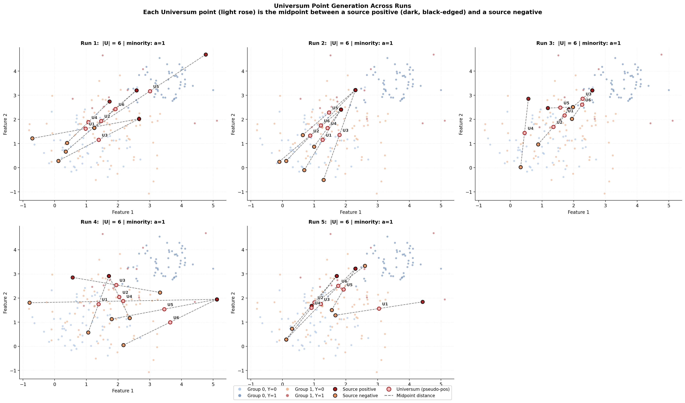

# Fair Collaborative Classification via Synthetic Bilevel Optimization and Universum Pseudo-Positives

A **privacy-preserving, fairness-aware federated classification pipeline** that enforces Equal Opportunity (EO) across sensitive groups without sharing raw client data.

## Problem

In federated learning, clients hold private data that cannot be shared. Standard methods (e.g., FedAvg) optimize only for accuracy and ignore group fairness — the classifier often has much lower true positive rate (TPR) for underrepresented groups. This pipeline ensures equal TPR across sensitive groups while keeping all client data private.

## Why Equal Opportunity (EO)?

**Equal Opportunity** requires that the true positive rate (TPR) be the same across sensitive groups:

```
|TPR(group 0) − TPR(group 1)| ≤ ε
```

### What EO Measures

EO focuses on the **positive class**: among people who truly deserve a positive outcome (Y=1), the classifier should accept them at equal rates regardless of their sensitive attribute (race, sex, etc.). This is the most relevant fairness criterion when:

- **False negatives are costly** — denying a qualified applicant a loan, rejecting a capable student, or failing to detect a disease in a patient.
- **Group-level harm is asymmetric** — the minority group's positives are harder to classify (fewer examples, more noise), so the classifier systematically under-predicts for them.

### Why EO Over Other Fairness Notions

| Fairness Notion | What It Requires | Limitation |
|---|---|---|
| **Demographic Parity** | P(Ŷ=1\|A=0) = P(Ŷ=1\|A=1) | Ignores ground truth — may accept unqualified or reject qualified |
| **Equalized Odds** | Equal TPR *and* equal FPR across groups | Over-constrains; hard to satisfy both simultaneously |
| **Equal Opportunity** | Equal TPR across groups | Focuses on what matters: correct positive predictions |
| **Calibration** | P(Y=1\|Ŷ=p, A) = p for all groups | Requires well-calibrated probabilities; incompatible with other notions |

EO strikes the best balance: it protects the disadvantaged group from being denied positive outcomes while not forcing the model to accept unqualified candidates. The constraint `g_EO` in our Augmented Lagrangian objective directly penalizes TPR disparity.

### How EO Is Implemented Here

The EO constraint is enforced through a **differentiable surrogate** (Eq. 4):

```
g_EO(θ) = (1/|B⁺|) Σ_{(x,s,1) ∈ B⁺} (s − s̄) · f_θ(x, s)
```

This measures the correlation between the sensitive attribute `s` and the model output `f_θ` among true positives `B⁺`. When `g_EO ≈ 0`, the model's predictions are independent of the sensitive attribute for the positive class — i.e., Equal Opportunity holds.

The surrogate is embedded in an **Augmented Lagrangian** framework:

```
Φ = L_out + λ · g_EO + (ρ/2) · g_EO²
```

where `λ` is updated each outer iteration (`λ ← λ + ρ · g_EO`), driving `g_EO → 0`. This is more stable than direct penalty methods because the Lagrange multiplier adapts automatically.

## Pipeline Overview

```
CLIENT k (each round)                          SERVER
─────────────────────                          ──────
1. Private data D^o_k
2. Stratified minibatch B (by a,y)
3. Synthetic batch D^s (fixed labels,          8. Aggregate payloads: ⋃_k S̃_{k,t}
   learnable features)                         9. Train global model θ^glob
4. Universum U (pseudo-positives at            10. Broadcast θ^glob as next ζ
   midpoints near boundary)                    11. Evaluate: Accuracy, F1, EO gap
5. Inner: train θ on D^s ∪ U
6. Outer: evaluate g_EO on real B,
   update features via implicit diff
7. Send payload S̃ = D^s ∪ U (no raw data)
```

**Privacy guarantee:** Clients never send original data. Only optimized synthetic features are transmitted.

## Universum Points

Universum points are synthetic **pseudo-positives** placed at the **midpoint between minority-positive and negative examples**. They inject balanced positive-class signal for the underrepresented group without using real data.

- **Size:** `|U| = min(Δˢ, |Dˢ|, Δₖ)` — proportional to the label imbalance
- **Placement:** `x_u = (x_minority_pos + x_neg) / 2` — near the decision boundary
- **Assignment:** All assigned to the minority-positive group (the one with fewer Y=1)
- **Effect:** Raises TPR for the disadvantaged group, reducing EO gap

When data is balanced (`Δ = 0`), no Universum points are needed.



*Each subplot shows a separate run. Stars are Universum pseudo-positives placed at midpoints near the decision boundary. Darker purple shades indicate later runs. Individual per-run plots are also saved as `universum_run_1.png` through `universum_run_5.png`.*

## Project Structure

```
├── draft_model/              Core algorithm
│   ├── notation.py           Data structures (paper Tables 1-2)
│   ├── minibatch_design.py   Stratified sampling, synthetic D^s, Universum U
│   ├── losses.py             Eq. 2-4: L_base, L_universum, g_EO, Φ
│   ├── bilevel_al.py         Algorithm 1: bilevel AL with CG solver
│   ├── server.py             Server aggregation + evaluation metrics
│   └── run_draft.py          End-to-end pipeline runner
│
├── pipeline/                 Data loaders
│   ├── load_2d.py            2D dataset loader
│   └── load_adult.py         UCI Adult dataset loader
│
├── run_2d_example.py         Generate 2D data + plot
├── visualize_universum.py    Universum generation visualization
├── stress_test_fairness.py   Fairness stress tests under imbalance
├── validate_pipeline.py      Automated pipeline validation checks
├── build_figures.py          Generate comparison plots
├── build_final_table.py      Generate results comparison table
├── requirements.txt
└── outputs/                  Generated results and figures
```

## Quick Start

```bash
# Install dependencies
pip install -r requirements.txt

# Generate 2D data and plot
python run_2d_example.py

# Visualize Universum generation
python visualize_universum.py

# Run the pipeline on 2D data
python -m draft_model.run_draft --data 2d

# Run on UCI Adult dataset
python -m draft_model.run_draft --data adult --sensitive sex

# Run stress tests
python stress_test_fairness.py

# Run validation checks
python validate_pipeline.py

# Generate figures and table
python build_figures.py
python build_final_table.py
```

### Ablation Experiments

```bash
# No Universum (ablation)
python -m draft_model.run_draft --data adult --no_universum

# No fairness constraint (ρ=0)
python -m draft_model.run_draft --data adult --fairness_off

# Simplified inner-only (no feature updates)
python -m draft_model.run_draft --data adult --no_full_al
```

## Results

| Scenario | Method | Accuracy | EO Gap |
|---|---|---|---|
| Moderate imbalance | Baseline (ERM) | 0.938 | **0.620** |
| Moderate imbalance | Pipeline (Synth+U+AL) | 0.725 | **0.070** |
| Strong imbalance | Baseline (ERM) | 0.970 | **0.857** |
| Strong imbalance | Pipeline (Synth+U+AL) | 0.800 | **0.143** |

The pipeline reduces EO gap by **89%** (moderate) and **83%** (strong) under imbalanced conditions, trading some overall accuracy for substantially fairer predictions.

## Key Equations

| Equation | Description |
|---|---|
| **Eq. 2** `L_base` | Logistic loss + L2 regularization toward reference ζ |
| **Eq. 3** `L_universum` | Encourages classifying Universum points as positive |
| **Eq. 4** `g_EO` | EO surrogate: correlation of sensitive attr with output on B⁺ |
| **Eq. 6** `Φ` | Augmented Lagrangian: L_out + λ·g + (ρ/2)·g² |

## Limitations

1. **Linear model only** — `f_θ(x,a) = θᵀ[x;a]`. Extension to neural networks requires changes to the Hessian-vector product.
2. **Prototype stage** — validated on synthetic stress tests. Real-world benchmarks (Adult, COMPAS) need further evaluation.
3. **Accuracy-fairness tradeoff** — improving minority TPR shifts the decision boundary, reducing overall accuracy. Tuning ρ and λ_U controls this tradeoff.
